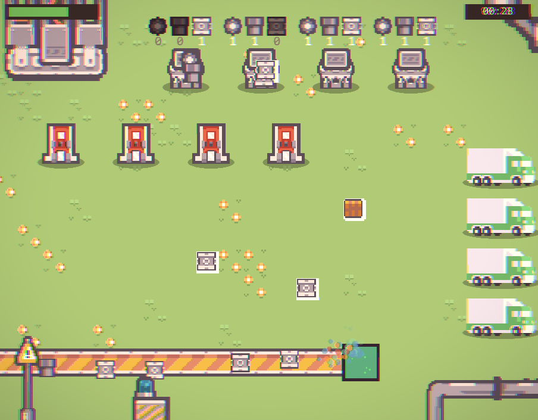

# Rush Order

A fast-paced 2D factory management game built with [Kaplay.js](https://kaplayjs.com/) and TypeScript.

**Play it on itch.io: [twistke.itch.io/rush-order](https://twistke.itch.io/rush-order)**


## Gameplay

Manage a production line by dragging items from the conveyor belt through assembly stations and into the packager, then deliver the packages to the waiting car.

- **+4 points** — deliver a completed package
- **-1 point** — drop or burn an item
- **Game over** at 0 points

The game ramps up over 120 seconds: the belt moves faster, assembly time shortens, and items spawn more frequently.

## Screenshots



## Tech Stack

- [Kaplay.js](https://kaplayjs.com/) — 2D game engine
- TypeScript
- Vite

## Getting Started

```bash
pnpm install
pnpm dev
```

Open `http://localhost:5173` in your browser.

## Build

```bash
pnpm build
pnpm preview
```
